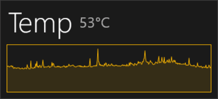
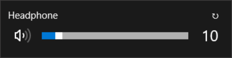

# Changes

## [Add] CPU temperature histogram

## [Add] UpTime Widget

## [Add] VoiceDevice Widget

## [Update] Switch VoiceDevice

---

# win10widgets
Widgets for Windows 10 http://win10widgets.com modified

## Added/Fixed features to the original
- GPU Widget
- Cryptocurrencies Widget
- Fixed Spotify
- More options to the Network Widget
- CPU/GPU Temperature Measure
- A Light Theme
- Fixed Weather

## Requirements

- Rainmeter
- Spicetify and WebNowPlaying if you want to use Spotify
- SpeedFan, HWiNFO, Core Temp and/or MSI Afterburner if you want to get the CPU/GPU Temperature

## Credits

- TJMarkham ( original author )
- khansas ( Spicetify )
- Eclectic-Tech ( Weather Patch )
